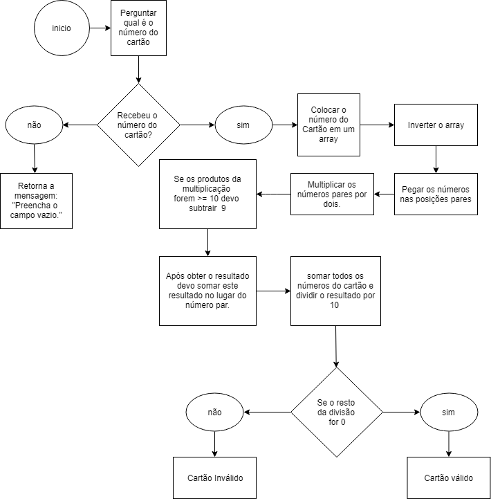

# cartao-valido
Validador de cartão de crédito

Passos:
- Perguntar qual é o número do cartão;
- Passar os números do cartão por um array em ordem inversa;
- Aplicar a operação aos números das posições pares;
- Somar os dígitos e novos dígitos produtos da multiplicação dos números pares;
- Comprovar se o cartão é válido;

